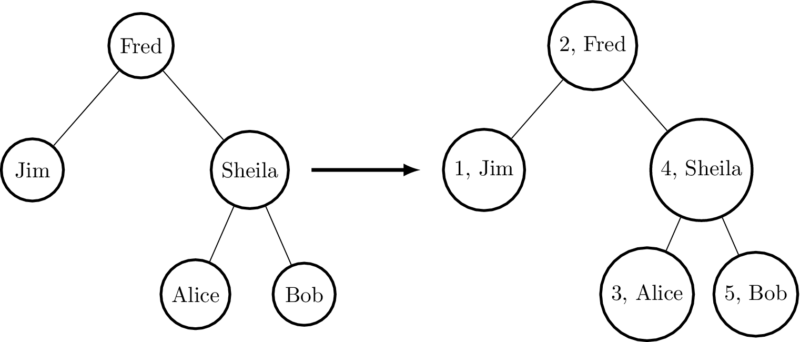

.. _sect-state:

*****
State
*****

Many programs, even pure programs, can benefit from locally mutable
state. For example, consider a program which tags binary tree nodes
with a counter, by an inorder traversal (i.e. counting depth first,
left to right). This would perform something like the following:

|image|

We can describe binary trees with the following data type ``BTree``
and ``testTree`` to represent the example input above:

.. code-block:: idris

    data BTree a = Leaf
                 | Node (BTree a) a (BTree a)

    testTree : BTree String
    testTree = Node (Node Leaf "Jim" Leaf)
                    "Fred"
                    (Node (Node Leaf "Alice" Leaf)
                          "Sheila"
                          (Node Leaf "Bob" Leaf))

Then our function to implement tagging, beginning to tag with a
specific value ``i``, has the following type:

.. code-block:: idris

    treeTag : (i : Int) -> BTree a -> BTree (Int, a)

First attempt
=============

Naïvely, we can implement ``treeTag`` by implementing a helper
function which propagates a counter, returning the result of the count
for each subtree:

.. code-block:: idris

    treeTagAux : (i : Int) -> BTree a -> (Int, BTree (Int, a))
    treeTagAux i Leaf = (i, Leaf)
    treeTagAux i (Node l x r)
           = let (i', l') = treeTagAux i l in
             let x' = (i', x) in
             let (i'', r') = treeTagAux (i' + 1) r in
                 (i'', Node l' x' r')

    treeTag : (i : Int) -> BTree a -> BTree (Int, a)
    treeTag i x = snd (treeTagAux i x)

This gives the expected result when run at the REPL prompt:

.. code-block:: idris

    *TreeTag> treeTag 1 testTree
    Node (Node Leaf (1, "Jim") Leaf)
         (2, "Fred")
         (Node (Node Leaf (3, "Alice") Leaf)
               (4, "Sheila")
               (Node Leaf (5, "Bob") Leaf)) : BTree (Int, String)

This works as required, but there are several problems when we try to
scale this to larger programs. It is error prone, because we need to
ensure that state is propagated correctly to the recursive calls (i.e.
passing the appropriate ``i`` or ``i’``). It is hard to read, because
the functional details are obscured by the state propagation. Perhaps
most importantly, there is a common programming pattern here which
should be abstracted but instead has been implemented by hand. There
is local mutable state (the counter) which we have had to make
explicit.

Introducing ``Effects``
=======================

Idris provides a library, ``Effects`` [3]_, which captures this
pattern and many others involving effectful computation [1]_. An
effectful program ``f`` has a type of the following form:

.. code-block:: idris

    f : (x1 : a1) -> (x2 : a2) -> ... -> Eff t effs

That is, the return type gives the effects that ``f`` supports
(``effs``, of type ``List EFFECT``) and the type the computation
returns ``t``. So, our ``treeTagAux`` helper could be written with the
following type:

.. code-block:: idris

    treeTagAux : BTree a -> Eff (BTree (Int, a)) [STATE Int]

That is, ``treeTagAux`` has access to an integer state, because the
list of available effects includes ``STATE Int``. ``STATE`` is
declared as follows in the module ``Effect.State`` (that is, we must
``import Effect.State`` to be able to use it):

.. code-block:: idris

    STATE : Type -> EFFECT

It is an effect parameterised by a type (by convention, we write
effects in all capitals). The ``treeTagAux`` function is an effectful
program which builds a new tree tagged with ``Ints``, and is
implemented as follows:

.. code-block:: idris

    treeTagAux Leaf = pure Leaf
    treeTagAux (Node l x r)
        = do l' <- treeTagAux l
             i <- get
             put (i + 1)
             r' <- treeTagAux r
             pure (Node l' (i, x) r')

There are several remarks to be made about this implementation.
Essentially, it hides the state, which can be accessed using ``get``
and updated using ``put``, but it introduces several new features.
Specifically, it uses ``do``-notation, binding variables with ``<-``,
and a ``pure`` function. There is much to be said about these
features, but for our purposes, it suffices to know the following:

- ``do`` blocks allow effectful operations to be sequenced.

- ``x <- e`` binds the result of an effectful operation ``e`` to a
   variable ``x``. For example, in the above code, ``treeTagAux l`` is
   an effectful operation returning ``BTree (Int, a)``, so ``l’`` has
   type ``BTree (Int, a)``.

- ``pure e`` turns a pure value ``e`` into the result of an effectful
   operation.

The ``get`` and ``put`` functions read and write a state ``t``,
assuming that the ``STATE t`` effect is available. They have the
following types, polymorphic in the state ``t`` they manage:

.. code-block:: idris

    get :      Eff t [STATE t]
    put : t -> Eff () [STATE t]

A program in ``Eff`` can call any other function in ``Eff`` provided
that the calling function supports at least the effects required by
the called function. In this case, it is valid for ``treeTagAux`` to
call both ``get`` and ``put`` because all three functions support the
``STATE Int`` effect.

Programs in ``Eff`` are run in some underlying *computation context*,
using the ``run`` or ``runPure`` function. Using ``runPure``, which
runs an effectful program in the identity context, we can write the
``treeTag`` function as follows, using ``put`` to initialise the
state:

.. code-block:: idris

    treeTag : (i : Int) -> BTree a -> BTree (Int, a)
    treeTag i x = runPure (do put i
                              treeTagAux x)

We could also run the program in an impure context such as ``IO``,
without changing the definition of ``treeTagAux``, by using ``run``
instead of ``runPure``:

.. code-block:: idris

    treeTagAux : BTree a -> Eff (BTree (Int, a)) [STATE Int]
    ...

    treeTag : (i : Int) -> BTree a -> IO (BTree (Int, a))
    treeTag i x = run (do put i
                          treeTagAux x)

Note that the definition of ``treeTagAux`` is exactly as before. For
reference, this complete program (including a ``main`` to run it) is
shown in Listing [introprog].

.. code-block:: idris

    module Main

    import Effects
    import Effect.State

    data BTree a = Leaf
                 | Node (BTree a) a (BTree a)

    Show a => Show (BTree a) where
        show Leaf = "[]"
        show (Node l x r) = "[" ++ show l ++ " "
                                ++ show x ++ " "
                                ++ show r ++ "]"

    testTree : BTree String
    testTree = Node (Node Leaf "Jim" Leaf)
                  "Fred"
                  (Node (Node Leaf "Alice" Leaf)
                        "Sheila"
                        (Node Leaf "Bob" Leaf))

    treeTagAux : BTree a -> Eff (BTree (Int, a)) [STATE Int]
    treeTagAux Leaf = pure Leaf
    treeTagAux (Node l x r) = do l' <- treeTagAux l
                                 i <- get
                                 put (i + 1)
                                 r' <- treeTagAux r
                                 pure (Node l' (i, x) r')

    treeTag : (i : Int) -> BTree a -> BTree (Int, a)
    treeTag i x = runPure (do put i; treeTagAux x)

    main : IO ()
    main = print (treeTag 1 testTree)

Effects and Resources
=====================

Each effect is associated with a *resource*, which is initialised
before an effectful program can be run. For example, in the case of
``STATE Int`` the corresponding resource is the integer state itself.
The types of ``runPure`` and ``run`` show this (slightly simplified
here for illustrative purposes):

.. code-block:: idris

    runPure : {env : Env id xs} -> Eff a xs -> a
    run : Applicative m => {env : Env m xs} -> Eff a xs -> m a

The ``env`` argument is implicit, and initialised automatically where
possible using default values given by implementations of the following 
interface:

.. code-block:: idris

    interface Default a where
        default : a

Implementations of ``Default`` are defined for all primitive types, and many
library types such as ``List``, ``Vect``, ``Maybe``, pairs, etc.
However, where no default value exists for a resource type (for
example, you may want a ``STATE`` type for which there is no
``Default`` implementation) the resource environment can be given explicitly
using one of the following functions:

.. code-block:: idris

    runPureInit : Env id xs -> Eff a xs -> a
    runInit : Applicative m => Env m xs -> Eff a xs -> m a

To be well-typed, the environment must contain resources corresponding
exactly to the effects in ``xs``. For example, we could also have
implemented ``treeTag`` by initialising the state as follows:

.. code-block:: idris

    treeTag : (i : Int) -> BTree a -> BTree (Int, a)
    treeTag i x = runPureInit [i] (treeTagAux x)

Labelled Effects
================

What if we have more than one state, especially more than one state of
the same type? How would ``get`` and ``put`` know which state they
should be referring to? For example, how could we extend the tree
tagging example such that it additionally counts the number of leaves
in the tree? One possibility would be to change the state so that it
captured both of these values, e.g.:

.. code-block:: idris

    treeTagAux : BTree a -> Eff (BTree (Int, a)) [STATE (Int, Int)]

Doing this, however, ties the two states together throughout (as well
as not indicating which integer is which). It would be nice to be able
to call effectful programs which guaranteed only to access one of the
states, for example. In a larger application, this becomes
particularly important.

The library therefore allows effects in general to be *labelled* so
that they can be referred to explicitly by a particular name. This
allows multiple effects of the same type to be included. We can count
leaves and update the tag separately, by labelling them as follows:

.. code-block:: idris

    treeTagAux : BTree a ->  Eff (BTree (Int, a))
                                   ['Tag ::: STATE Int,
                                    'Leaves ::: STATE Int]

The ``:::`` operator allows an arbitrary label to be given to an
effect.  This label can be any type—it is simply used to identify an
effect uniquely. Here, we have used a symbol type. In general
``’name`` introduces a new symbol, the only purpose of which is to
disambiguate values [2]_.

When an effect is labelled, its operations are also labelled using the
``:-`` operator. In this way, we can say explicitly which state we
mean when using ``get`` and ``put``. The tree tagging program which
also counts leaves can be written as follows:

.. code-block:: idris

    treeTagAux Leaf = do
        'Leaves :- update (+1)
        pure Leaf
    treeTagAux (Node l x r) = do
        l' <- treeTagAux l
        i <- 'Tag :- get
        'Tag :- put (i + 1)
        r' <- treeTagAux r
        pure (Node l' (i, x) r')

The ``update`` function here is a combination of ``get`` and ``put``,
applying a function to the current state.

.. code-block:: idris

    update : (x -> x) -> Eff () [STATE x]

Finally, our top level ``treeTag`` function now returns a pair of the
number of leaves, and the new tree. Resources for labelled effects are
initialised using the ``:=`` operator (reminiscent of assignment in an
imperative language):

.. code-block:: idris

    treeTag : (i : Int) -> BTree a -> (Int, BTree (Int, a))
    treeTag i x = runPureInit ['Tag := i, 'Leaves := 0]
                        (do x' <- treeTagAux x
                            leaves <- 'Leaves :- get
                            pure (leaves, x'))

To summarise, we have:

- ``:::`` to convert an effect to a labelled effect.

- ``:-`` to convert an effectful operation to a labelled effectful operation.

- ``:=`` to initialise a resource for a labelled effect.

Or, more formally with their types (slightly simplified to account
only for the situation where available effects are not updated):

.. code-block:: idris

    (:::) : lbl -> EFFECT -> EFFECT
    (:-)  : (l : lbl) -> Eff a [x] -> Eff a [l ::: x]
    (:=)  : (l : lbl) -> res -> LRes l res

Here, ``LRes`` is simply the resource type associated with a labelled
effect. Note that labels are polymorphic in the label type ``lbl``.
Hence, a label can be anything—a string, an integer, a type, etc.

``!``-notation
==============

In many cases, using ``do``-notation can make programs unnecessarily
verbose, particularly in cases where the value bound is used once,
immediately. The following program returns the length of the
``String`` stored in the state, for example:

.. code-block:: idris

    stateLength : Eff Nat [STATE String]
    stateLength = do x <- get
                     pure (length x)

This seems unnecessarily verbose, and it would be nice to program in a
more direct style in these cases. provides ``!``-notation to help with
this. The above program can be written instead as:

.. code-block:: idris

    stateLength : Eff Nat [STATE String]
    stateLength = pure (length !get)

The notation ``!expr`` means that the expression ``expr`` should be
evaluated and then implicitly bound. Conceptually, we can think of
``!`` as being a prefix function with the following type:

.. code-block:: idris

    (!) : Eff a xs -> a

Note, however, that it is not really a function, merely syntax! In
practice, a subexpression ``!expr`` will lift ``expr`` as high as
possible within its current scope, bind it to a fresh name ``x``, and
replace ``!expr`` with ``x``. Expressions are lifted depth first, left
to right. In practice, ``!``-notation allows us to program in a more
direct style, while still giving a notational clue as to which
expressions are effectful.

For example, the expression:

.. code-block:: idris

    let y = 42 in f !(g !(print y) !x)

is lifted to:

.. code-block:: idris

    let y = 42 in do y' <- print y
                     x' <- x
                     g' <- g y' x'
                     f g'

The Type ``Eff``
================

Underneath, ``Eff`` is an overloaded function which translates to an
underlying type ``EffM``:

.. code-block:: idris

    EffM : (m : Type -> Type) -> (t : Type)
            -> (List EFFECT)
            -> (t -> List EFFECT) -> Type

This is more general than the types we have been writing so far. It is
parameterised over an underlying computation context ``m``, a
result type ``t`` as we have already seen, as well as a ``List EFFECT`` and a
function type ``t -> List EFFECT``.

These additional parameters are the list of *input* effects, and a
list of *output* effects, computed from the result of an effectful
operation.  That is: running an effectful program can change the set
of effects available! This is a particularly powerful idea, and we
will see its consequences in more detail later. Some examples of
operations which can change the set of available effects are:

- Updating a state containing a dependent type (for example adding an element to a vector).

- Opening a file for reading is an effect, but whether the file really
  *is* open afterwards depends on whether the file was successfully
  opened.

- Closing a file means that reading from the file should no longer be
  possible.

While powerful, this can make uses of the ``EffM`` type hard to read.
Therefore the library provides an overloaded function ``Eff``
There are the following three versions:

.. code-block:: idris

    SimpleEff.Eff : (t : Type) -> (input_effs : List EFFECT) -> Type
    TransEff.Eff  : (t : Type) -> (input_effs : List EFFECT) ->
                                  (output_effs : List EFFECT) -> Type
    DepEff.Eff    : (t : Type) -> (input_effs : List EFFECT) ->
                                  (output_effs_fn : x -> List EFFECT) -> Type

So far, we have used only the first version, ``SimpleEff.Eff``, which
is defined as follows:

.. code-block:: idris

    Eff : (x : Type) -> (es : List EFFECT) -> Type
    Eff x es = {m : Type -> Type} -> EffM m x es (\v => es)

i.e. the set of effects remains the same on output. This suffices for
the ``STATE`` example we have seen so far, and for many useful
side-effecting programs. We could also have written ``treeTagAux``
with the expanded type:

.. code-block:: idris

    treeTagAux : BTree a ->
                 EffM m (BTree (Int, a)) [STATE Int] (\x => [STATE Int])

Later, we will see programs which update effects:

.. code-block:: idris

    Eff a xs xs'

which is expanded to

.. code-block:: idris

    EffM m a xs (\_ => xs')

i.e. the set of effects is updated to ``xs’`` (think of a transition
in a state machine). There is, for example, a version of ``put`` which
updates the type of the state:

.. code-block:: idris

    putM : y -> Eff () [STATE x] [STATE y]

Also, we have:

.. code-block:: idris

    Eff t xs (\res => xs')

which is expanded to

.. code-block:: idris

    EffM m t xs (\res => xs')

i.e. the set of effects is updated according to the result of the
operation ``res``, of type ``t``.

Parameterising ``EffM`` over an underlying computation context allows us
to write effectful programs which are specific to one context, and in some
cases to write programs which *extend* the list of effects available using
the ``new`` function, though this is beyond the scope of this tutorial.

.. [1] The earlier paper [3]_ describes the essential implementation
   details, although the library presented there is an earlier version
   which is less powerful than that presented in this tutorial.

.. [2] In practice, ``’name`` simply introduces a new empty type

.. [3] Edwin Brady. 2013. Programming and reasoning with algebraic
       effects and dependent types. SIGPLAN Not. 48, 9 (September
       2013), 133-144. DOI=10.1145/2544174.2500581
       http://dl.acm.org/citation.cfm?doid=2544174.2500581

