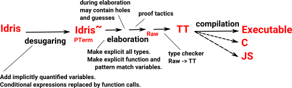
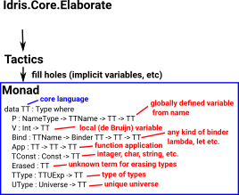

Extending Idris using Elaborator Reflection
===========================================

Idris provides a mechanism to modify the language without having to recompile Idris itself. We can think of this in terms of metaprogramming or domain specific languages or just building in new capabilities.

In order to extend the language we need to know something about how Idris is compiled. This page explains only what is needed to customise the elaboration. For more information about the compiler's implementation see `Edwin Brady's 2013 paper`_ and for customising the elaboration process see `Elaborator reflection: extending Idris in Idris`_ and `David Christiansen's PhD thesis`_.

Compilation of Idris proceeds through a number of stages.

- First, Idris is desugared by inserting placeholders for terms to be guessed by the compiler and replacing certain syntactic forms, such as do-notation, with the functions that implement them.
- Then, this desugared Idris is translated into a much simpler core language, called TT. This translation process is called elaboration.
- Finally, TT is type checked a second time to rule out errors, and then compiled into the target language.

TT is a core language which is syntactically very simple. This makes it easy for computers to process but very verbose and hard for humans to read. The Idris elaborator is written in Haskell using an elaboration library that was inspired by the tactics in interactive proof assistants such as Coq.

.. list-table::

   * - There are some similarities with a proof assistant but in Idris the elaborator is an interpreter of Idris source in the elaboration monad, where each syntactic construct of Idris is interpreted as a sequence of tactics.
     - .. image:: ../image/compareToProofAssist.png
          :width: 206px
          :height: 112px
          :alt: diagram comparing elaboration with proof assistant

The primitives in the elaboration library are not just useful for the implementors of Idris itself. They can also be used by authors of extensions to the compiler, using a mechanism known as elaborator reflection.
During elaboration TT (Raw) structure contains:

- holes - placeholders for terms that have not yet been filled in.
- guesses - similar to let bindings, except with no reduction rule, so that elaboration programs can control the precise shape of terms that are under construction.

For more information about holes and guesses see `Dependently Typed Functional Programs and their Proofs by McBride 1999`_.

The following diagram is intended to illustrate a high level view of the tactics and how this eventually results in the TT language being generated. It is not necessary to understand the details at this stage. The intention is to help build up some intuition so that, when we get into the details, we can recognise how this fits into the big picture.

As already mentioned the TT core language is kept syntactically very simple, for instance, here are the binders in TT with corresponding code and logic type validity rules:

.. list-table::

   * - This diagram illustrates the basis of the compilation process in logic (in this case for binders). It is not necessary to be an expert logician to understand elaborator reflection. However, when learning about tactics, they may appear arbitrary without knowing some theory. For more information about this see `Edwin Brady's 2013 paper`_.
     - .. image:: ../image/binders.png
          :width: 310px
          :height: 203px
          :alt: diagram illustrating basis of code in logic

.. target-notes::
.. _`Edwin Brady's 2013 paper`: https://eb.host.cs.st-andrews.ac.uk/drafts/impldtp.pdf
.. _`Elaborator reflection: extending Idris in Idris`: https://dl.acm.org/citation.cfm?doid=2951913.2951932
.. _`David Christiansen's PhD thesis`: https://davidchristiansen.dk/david-christiansen-phd.pdf
.. _`Dependently Typed Functional Programs and their Proofs by McBride 1999`: https://www.era.lib.ed.ac.uk/handle/1842/374

