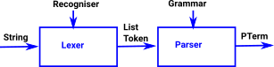
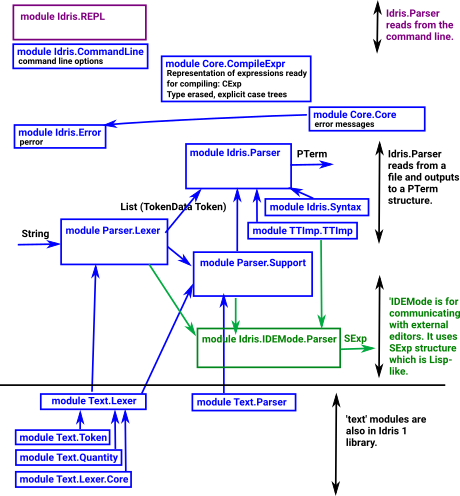

.. _parserLibraryIntro:

***************************
Parser Library Introduction
***************************

The parser library can be used to build Idris structures from text. It involves a
certain amount of complexity and so it would typically be used for big projects. An
example might be a compiler for another language, written in Idris.

Of course the parser library can also be used to compile to Idris, this is what is
done in Idris 2 and that is what the this library appears to have been written for.

So a secondary use for this tutorial would be to help understanding the internal
workings of Idris 2.

The parser library is used in a similar way to Parsec which is a library for writing parsers in Haskell. It is based on higher-order parser combinators, so a complicated parser can be made out of many smaller ones.

.. list-table::

  * - This is a two stage process:
        - Lexer - This takes the input string and turns it into a list of Tokens.
        - Parser - This takes the list of tokens and outputs the code.

The advantage of using two stages, like this, is that things like whitespace and comments don't need to be considered in every parser rule.

The  Idris parser library differs from Parsec in that you need to say in the Recogniser whether a rule is guaranteed to consume input. This means that the Idris type system prevents the construction of recognisers/rules that can't consume the input.

The Lexer is similar but works at the level of characters rather than tokens, and you need to provide a TokenMap which says how to build a token representation from a string when a rule is matched.

The following pages contain a tutorial for the :ref:`parserLibraryLexer` and a tutorial for the :ref:`parserLibraryParser`. These tutorials have a running
example of a parser for integer expressions. This is a very simple example, there
may be easier ways to do something so simple, but it illustrates some of the principles.

Parser Library and Idris 2
--------------------------

The parser library, in Idris 1, is almost the same as the code that the Idris 2
parser is built on. Even if you only want to use the Idris 1 parser library it
is useful to look at the code in the Idris 2 compilers to see how the library can be used.

Idris 2 has at least 3 compilers:

- IDEMode - complies to SExp which is a Lisp-like structure used to communicate
  with external editors like Emacs and Vim.
- Idris.Parser - This is the main compiler which compiles from a file to
  PTerm (and eventually TT structure).
- REPL - compiles input from the command line.

The following diagram is my first attempt to work out how some of the modules in
Idris 2 fit together (with a few of the dependencies between them shown). The
Idris 1 library is based on the modules at the bottom of the diagram (shown
in red).

