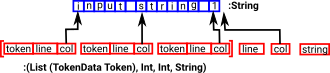
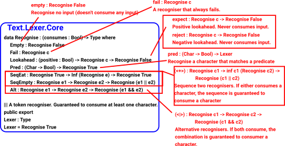

.. _parserLibraryLexer:

Lexer
=====

The lexer is run by calling the 'lex' function in the Text.Lexer.Core
module:

.. code-block:: idris

 lex : TokenMap a -> String -> (List (TokenData a), (Int, Int, String))

This function takes a String and returns a list of tokens. With the tokens we
have indexes back to the original string which can be used in error messages:

TokenMap
--------

In order to construct this list of tokens we need:

- A way to recognise the tokens in the input string.
- A way to construct these individual tokens.

This is given by the TokenMap. This is a  mapping from lexers to the tokens
they produce. This is a list of pairs:

.. code-block:: idris

  (Lexer, String -> tokenType)

So for each Lexer in the list, if a substring in the input matches, run
the associated function to produce a token of type `tokenType`

from Text.Lexer.Core:

.. code-block:: idris

  TokenMap : (tokenType : Type) -> Type
  TokenMap tokenType = List (Lexer, String -> tokenType)

We can create a tokenMap by using a function like this:

.. code-block:: idris

  myTokenMap : TokenMap Token
  myTokenMap = [(is 'a',CharLit)]

Once we have a TokenMap we can use it to lex many strings.

Recognisers
-----------

The first part of each entry in the TokenMap is the recogniser.

A simple recogniser is 'Pred' which uses a predicate (Char -> Bool) to
test whether to accept the character. It can be constructed using the 'is' function:

.. code-block:: idris

  *parserEx> is 'a'
  Pred (\ARG =>
           intToBool (prim__eqChar ARG 'a'))
                              : Recognise True

More complicated structures can be recognised as tokens, this is done using
the combinator structure of recognisers. This allows recognisers to be
combined, for example,

.. list-table::

  * - <+> means sequence two recognisers. If either consumes a character, the sequence
      is guaranteed to consume a character.

    -  .. code-block:: idris

         *parserEx> is 'a' <+> is 'b'
         SeqEat (Pred (\ARG => intToBool (prim__eqChar ARG 'a')))
               (Delay (is 'b')) : Recognise True

  * - <|> means if both consume, the combination is guaranteed
      to consumer a character:

    - .. code-block:: idris

        *parserEx> is 'a' <|> is 'b'
        Alt (Pred (\ARG => intToBool (prim__eqChar ARG 'a')))
            (Pred (\ARG => intToBool (prim__eqChar ARG 'b')))
                : Recognise True

This diagram shows the recogniser combinator with some of its constructors:

A recogniser consumes its input, that is it advances the index to its input
string, as it generates the token list. In some cases we don't want this to
happen, for instance, we may need to lookahead before consuming the input
string.

If a recogniser does not consume input there is a danger of an infinite loop.
To prevent this the recogniser is dependent on a boolean called 'consumes' which
is true if the recogniser is guaranteed to consume at least one character.

The constructors of Recognise allow us to ensure that, event though parts of
the recogniser may not consume, overall the recogniser will consume.

Since 'Recognise True' is more common than 'Recognise False' it is convenient to
use 'Lexer' as a type synonym for 'Recognise True'.

Whitespace and Comments
-----------------------

An important reason to have a lexer is to simplify the parser when whitespace
or comments are required. Without this the parser would require a match for
every combination, with and without, whitespace and comments.

In some languages the lexer needs to remove whitespace and comments so that
they don't appear in the token list. In some cases whitespace is significant
but a single whitespace token can stand for any number of spaces, tabs,
carriage returns and so on.

In some cases, such as when parsing the Idris language itself, whitespace
is important to indicate blocks. In this case we might want to output a
start-of-block token when the indent increases and an end-of-block token
when the indent decreases.

This topic needs to be more fully expanded here. Until someone does that, a
possible way to get more information is to see how it is done in Idris 2
_`here`: https://github.com/edwinb/Idris2/blob/master/src/Parser/Lexer.idr

Simple Expression Example for Lexer
-----------------------------------

On this page we will implement a lexer to lex a very simple expression as
a running example, on the next page, we will go on to implement a parser for it.

First import the lexer and parser code:

.. code-block:: idris

  module ParserExample

  import Text.Lexer
  import public Text.Parser.Core
  import public Text.Parser

Then decide on the tokens that are needed. For this example the idea is to be
able to parse simple arithmetic expressions, like this:

.. code-block:: idris

  1+(2*3)

so we need:

- Numbers (for now integer literals are good enough).
- Some operators (for now '+', '-' and '*' will do.
- Opening and closing Parentheses.

We can define these, as tokens, like this:

.. code-block:: idris

  %default total

  public export
  data ExpressionToken = Number Integer
           | Operator String
           | OParen
           | CParen
           | EndInput

It may help with debugging and to implement error messages to
implement 'show' for these tokens:

.. code-block:: idris

  export
  Show ExpressionToken where
    show (Number x) = "number " ++ show x
    show (Operator x) = "operator " ++ x
    show OParen = "("
    show CParen = ")"
    show EndInput = "end of input"

  export
  Show (TokenData ExpressionToken) where
    show (MkToken l c t) = "line=" ++ show l ++ " col=" ++ show c ++ "tok=" ++ show t

The following defines the 'TokenMap' for this example:

.. code-block:: idris

  ||| integer arithmetic operators plus, minus and multiply.
  export
  opChars : String
  opChars = "+-*"

  operator : Lexer
  operator = some (oneOf opChars)

  toInt' : String -> Integer
  toInt' = cast

  expressionTokens : TokenMap ExpressionToken
  expressionTokens =
     [(digits, \x => Number (toInt' x)),
     (operator, \x => Operator x),
     (is '(' ,\x => OParen),
     (is ')' ,\x => CParen)]

This specifies the lexer. It gives, for each token, a function to recognise
the token type and a function to construct the token.

The library module 'Text.Lexer' contains useful functions to help with this.
For example, the digits function used above, which reads one or more
numeric characters.

We can now run the code with various strings to see what output the lexer
produces. This is done by calling the 'lex' function with the TokenMap and
input string as parameters:

.. code-block:: idris

  cd Idris-dev/libs/contrib
  idris -p contrib parserEx.idr
       ____    __     _
      /  _/___/ /____(_)____
      / // __  / ___/ / ___/     Version 1.3.2
    _/ // /_/ / /  / (__  )      http://www.idris-lang.org/
   /___/\__,_/_/  /_/____/       Type :? for help

  Idris is free software with ABSOLUTELY NO WARRANTY.
  For details type :warranty.
  Type checking ./Text/Token.idr
  Type checking ./Text/Quantity.idr
  Type checking ./Control/Delayed.idr
  Type checking ./Data/Bool/Extra.idr
  Type checking ./Text/Lexer/Core.idr
  Type checking ./Text/Lexer.idr
  Type checking ./parserEx.idr

  *parserEx> lex expressionTokens "1+2"
  ([MkToken 0 0 (Number 1),
    MkToken 0
          (case fspan (\ARG => not (intToBool (prim__eqChar ARG '\n'))) "1" of
             (incol, "") => c + cast (length incol)
             (incol, b) => cast (length incol))
          (Operator "+"),
    MkToken 0
          (case fspan (\ARG => not (intToBool (prim__eqChar ARG '\n'))) "+" of
             (incol, "") => c + cast (length incol)
             (incol, b) => cast (length incol))
          (Number 2)],
   0,
   case fspan (\ARG => not (intToBool (prim__eqChar ARG '\n'))) "2" of
     (incol, "") => c + cast (length incol)
     (incol, b) => cast (length incol),
   getString (MkStrLen "" 0)) : (List (TokenData ExpressionToken),
                               Int,
                               Int,
                               String)

The lexer uses potentially infinite data structures. It has recursive arguments (codata type) so code is lazy. In the example the indexes have not been computed but we can
pick out the tokens:

- (Number 1)
- (Operator "+")
- (Number 2)

So the code is working.

We can now go ahead and parse this token list. A parser for this example will
be constructed on the next page.
