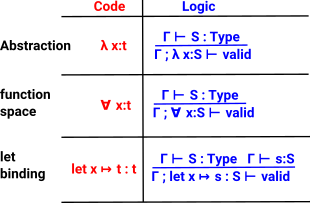

Extending Idris using Elaborator Reflection
===========================================

Idris provides a mechanism to modify the language without having to recompile Idris itself. We can think of this in terms of metaprogramming or domain specific languages or just building in new capabilities.

In order to extend the language we need to know something about how Idris is compiled. This page explains only what is needed to customise the elaboration. For more information about the compiler's implementation see `Edwin Brady's 2013 paper`_ and for customising the elaboration process see `Elaborator reflection: extending Idris in Idris`_ and `David Christiansen's PhD thesis`_ .

Compilation of Idris proceeds through a number of stages.

- First, Idris is desugared by inserting placeholders for terms to be guessed by the compiler and replacing certain syntactic forms, such as do-notation, with the functions that implement them.
- Then, this desugared Idris is translated into a much simpler core language, called TT. This translation process is called elaboration.
- Finally, TT is type checked a second time to rule out errors, and then compiled into the target language.

.. image:: ../image/idrisTopLevel.png
   :width: 484px
   :height: 147px
   :alt: diagram showing these stages of Idris compilation

TT is a core language which is syntactically very simple, this makes it easy for computers to process but very verbose and hard for humans to read. This elaboration is done by a logic language (proof tactics) similar to LTac in Coq. Here the word 'tactics' is used to refer to these elaboration tactics - not to be confused with the old tactics mechanism.

.. list-table::

   * - There are some similarities with a proof assistant but in Idris the elaborator is an interpreter of Idris source in the elaboration monad, where each syntactic construct of Idris is interpreted as a sequence of tactics.
     - .. image:: ../image/compareToProofAssist.png
          :width: 229px
          :height: 114px
          :alt: diagram comparing elaboration with proof assistant

The primitives in the elaboration library are not just useful for the implementors of Idris itself. They can also be used by authors of extensions to the compiler, using a mechanism known as elaborator reflection.
During elaboration TT (Raw) structure contains:

- holes - placeholders for terms that have not yet been filled in.
- guesses - similar to let bindings, except with no reduction rule, so that elaboration programs can control the precise shape of terms that are under construction.

Type checker:

- include universe levels
- distinguish between global and local bound names.

.. image:: ../image/elabOverview.png
   :width: 268px
   :height: 219px
   :alt: alternate text

As already mentioned the TT core language is kept syntactically very simple. Part of the reason for this is that its correctness is already well proven using logic. For instance, here are the binders in TT with corresponding code and logic type introduction rules:

.. list-table::

   * - There is an elaborator for both definitions and terms, the definition elaborator calls the term elaborator when required.
     - .. image:: ../image/elab.png
          :width: 141px
          :height: 145px
          :alt: alternate text

.. target-notes::
.. _`Edwin Brady's 2013 paper`: https://eb.host.cs.st-andrews.ac.uk/drafts/impldtp.pdf
.. _`Elaborator reflection: extending Idris in Idris`: https://dl.acm.org/citation.cfm?doid=2951913.2951932
.. _`David Christiansen's PhD thesis`: https://davidchristiansen.dk/david-christiansen-phd.pdf

