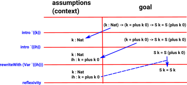

***************************
Interactive Theorem Proving
***************************

Idris supports interactive theorem proving via elaborator reflection.

:ref:`elaborator-reflection` is also used to convert high-level Idris code into
the core language and for customising the language. Here we show how to use it
to interactively construct proofs.

The primary purpose of the elaboration mechanism is to elaborate Idris and so it
is not optimised to work as a proof assistant, however it can interactively
construct proofs as described on this page.

Elab and Pruviloj Libraries
===========================

Elaborator reflection is defined in prelude/Language/Reflection/Elab.idr
and pruviloj is defined in Idris-dev/libs/pruviloj/

``Elab`` defines the basics such as: solve, attack, intro, compute,
rewriteWith and others.
``pruviloj`` defines some more advanced derived commands such as:
reflexivity and others.

To use ``pruviloj`` call Idris with the "-p pruviloj" option and add:

.. code-block:: idris

    import Pruviloj
    import Pruviloj.Induction

to the top of your file.

It is useful to get the docs at the REPL by using the ``:doc`` command, and
search the docstrings using ``:apropos``. So to introduce the functions from
Elab and Pruviloj, that we will need for the following example, here are
their docstrings:

.. code-block:: idris

    *plusReducesZ> :doc solve
    Language.Reflection.Elab.Tactics.solve : Elab ()
        Substitute a guess into a hole.

.. code-block:: idris

    *plusReducesZ> :doc attack
    Language.Reflection.Elab.Tactics.attack : Elab ()
        Convert a hole to make it suitable for bindings - that is, transform
        it such that it has the form ?h : t . h as opposed to ?h : t . f h.

        The binding tactics require that a hole be directly under its binding,
        or else the scopes of the generated terms won't make sense. This
        tactic creates a new hole of the proper form, and points the old hole
        at it.

.. code-block:: idris

    *plusReducesZ> :doc intro
    Language.Reflection.Elab.Tactics.intro : (n : TTName) -> Elab ()
        Introduce a lambda binding around the current hole and focus on the
        body. Requires that the hole be in binding form (use attack).
        Arguments:
            n : TTName  -- the name to use for the argument

.. code-block:: idris

    *plusReducesZ> :doc compute
    Language.Reflection.Elab.Tactics.compute : Elab ()
        Normalise the goal.

.. code-block:: idris

    *plusReducesZ> :doc rewriteWith
    Language.Reflection.Elab.Tactics.rewriteWith : Raw -> Elab ()
        Attempt to rewrite the goal using an equality.

        The tactic searches the goal for applicable subterms, and constructs a
        context for replace using them. In some cases, this is not possible,
        and replace must be called manually with an appropriate context.

        Because this tactic internally introduces a let binding, it requires
        that the hole be immediately under its binder (use attack if it might
        not be).

Here is the command from pruviloj that we will need for the example on
this page:

.. code-block:: idris

    *plusReducesZ> :doc reflexivity
    Pruviloj.Core.reflexivity : Elab ()
        A special-purpose tactic that attempts to solve a goal using Refl.
        This is useful for ensuring that goals in fact are trivial when
        developing or testing other tactics; otherwise, consider using search.

Interactive Example: plusReduces
================================

One way to write proofs interactively is to write the general *structure* of
the proof, and use the interactive mode to complete the details.
Consider the following definition, proved in :ref:`sect-theorems`:

.. code-block:: idris

    plusReduces : (n:Nat) -> plus Z n = n

We’ll be constructing the proof by *induction*, so we write the cases for ``Z``
and ``S``, with a recursive call in the ``S`` case giving the inductive
hypothesis, and insert *holes* for the rest of the definition:

.. code-block:: idris

    import Pruviloj
    import Pruviloj.Induction

    plusReducesZ' : (n:Nat) -> n = plus n Z
    plusReducesZ' Z     = ?plusredZ_Z
    plusReducesZ' (S k) = let ih = plusReducesZ' k in
                          ?plusredZ_S

On running , two global names are created, ``plusredZ_Z`` and
``plusredZ_S``, with no definition.

.. code-block:: idris

    *theorems> : idris plusReducesZ.idr -p pruviloj

    .  /  _/___/ /____(_)____
       / // __  / ___/ / ___/     Version 1.2.0
     _/ // /_/ / /  / (__  )      http://www.idris-lang.org/
    /___/\__,_/_/  /_/____/       Type :? for help

    Idris is free software with ABSOLUTELY NO WARRANTY.
    For details type :warranty.
    Holes: Main.plusredZ_S, Main.plusredZ_Z

This tells us that we have two holes Main.plusredZ_S and Main.plusredZ_Z. We can solve
these separately, ``plusredZ_Z`` is the simplest so we will do that first.

The ``:elab plusredZ_Z`` command enters interactive elaboration mode, which can be used to
complete the missing definition for plusredZ_Z.

.. code-block:: idris

    *plusReducesZ> :elab plusredZ_Z

    ----------                 Goal:                  ----------
    {hole_0} : 0 = 0

This has been normalised to ``0 = 0`` so now we have to prove that ``0`` equals ``0``, which
is easy to prove by reflexivity from the pruviloj library:

.. code-block:: idris

    -Main.plusredZ_Z> reflexivity
    plusredZ_Z: No more goals.

This tells us that the proof is complete. We can now leave the interactive mode which
we entered with the ``:elab`` command. We do this with the ``:qed`` command:

.. code-block:: idris

    -Main.plusredZ_Z> :qed
    Proof completed!
    Main.plusredZ_Z = %runElab (do reflexivity)
    Holes: Main.plusredZ_S

This gives us a trace of the proof which is ``plusredZ_Z = %runElab (do reflexivity)``. We
can cut & paste this into the hole in the original file. This also tells us that we
have another hole ``Main.plusredZ_S`` remaining.

This remaining proof is bit more complicated, the following diagram gives an overview:

|image|

We approach this remaining proof in the same way by using the ``:elab`` command:

.. code-block:: idris

    *plusReducesZ> :elab plusredZ_S

    ----------                 Goal:                  ----------
    {hole_0} : (k : Nat) -> (k = plus k 0) -> S k = S (plus k 0)

In this case, the goal is a function type, using ``k`` (the argument
accessible by pattern matching) and ``ih`` — the local variable
containing the result of the recursive call. We can introduce these as
assumptions using the ``intro`` tactic twice. The parameter is entered as
a constant of type ``TTName`` which is entered as a backtick with double
braces `{{ih}}. This gives:

.. code-block:: idris

    -Main.plusredZ_S> intro `{{k}}

    ----------              Assumptions:              ----------
     k : Nat
    ----------                 Goal:                  ----------
    {hole_0} : (k = plus k 0) -> S k = S (plus k 0)
    -Main.plusredZ_S> intro `{{ih}}

    ----------              Assumptions:              ----------
     k : Nat
     ih : k = plus k 0
    ----------                 Goal:                  ----------
    {hole_0} : S k = S (plus k 0)

We know, from the type of ``ih``, that ``k = plus k 0``, so we would
like to use this knowledge to replace ``plus k 0`` in the goal with
``k``. We can achieve this with the ``rewriteWith`` tactic:

.. code-block:: idris

    -Main.plusredZ_S> rewriteWith (Var `{{ih}})

    ----------              Assumptions:              ----------
     k : Nat
     ih : k = plus k 0
    ----------                 Goal:                  ----------
    {hole_0} : S k = S k

The ``rewriteWith`` tactic takes an equality proof as an argument, and tries
to rewrite the goal using that proof. The ih value is entered as a constant
of type ``TTName`` which is entered as a backtick with double braces `{{ih}} but
``rewriteWith`` requires an expression of type ``Raw``, rather than just a name,
so the Var constructor is used to make a variable. Here, it results in an equality
which is trivially provable using reflexivity:

.. code-block:: idris

    -Main.plusredZ_S> reflexivity
    plusredZ_S: No more goals.
    -Main.plusredZ_S> :qed
    Proof completed!
    Main.plusredZ_S = %runElab (do intro `{{k}}
                                   intro `{{ih}}
                                   rewriteWith (Var `{{ih}})
                                   reflexivity)

We can't just cut & paste this into the hole in the original file like this:

.. code-block:: idris

  import Pruviloj
  import Pruviloj.Induction

  %language ElabReflection

  plusReducesZ' : (n:Nat) -> n = plus n Z
  plusReducesZ' Z     = %runElab (do reflexivity)
  plusReducesZ' (S k) = let ih = plusReducesZ' k in
                      (%runElab (do intro `{{k}}
                               intro `{{ih}}
                               rewriteWith (Var `{{ih}})
                               reflexivity)
                      )

because this gives the following error:

.. code-block:: idris

  Idris> :load elabInteractiveEx2.idr
  elabInteractiveEx2.idr:10:32:
     |
  10 |                                intro `{{ih}}
     |                                ^
  unexpected "in"
  expecting dependent type signature

However if we put the proof into a separate function like this:

.. code-block:: idris

  import Pruviloj
  import Pruviloj.Induction

  %language ElabReflection

  plusredZ_S : (k : Nat) -> (ih:(k = plus k Z)) -> (S k = S (plus k Z))
  plusredZ_S = %runElab (do intro `{{k}}
                            intro `{{ih}}
                            rewriteWith (Var `{{ih}})
                            reflexivity)

  plusReducesZ' : (n:Nat) -> n = plus n Z
  plusReducesZ' Z     = %runElab (do reflexivity)
  plusReducesZ' (S k) = let ih = plusReducesZ' k in plusredZ_S k ih

This then loads.

.. [#f1] https://github.com/idris-lang/Idris-dev/issues/4556

