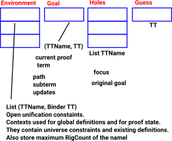

Elaborator Reflection - Tactics
===============================

The Idris part of the code for elaborator reflection is in
Elab.idr `<https://github.com/idris-lang/Idris-dev/blob/master/libs/prelude/Language/Reflection/Elab.idr>`_
Before looking at the Elab monad we need to know how to construct terms.

Proof State
-----------

The terminology 'Proof State' is used by analogy to proof assistants but, as used here, it's really more of a metaprogramming state.

Tactics operate on the proof state. The proof state contains various pieces of information, at this stage, the important ones for us are:

- A hole queue - This contains a list of the names of the holes used in the proof term. The solution to each hole may depend on the other holes. For more information about holes and guesses see `Dependently Typed Functional Programs and their Proofs by McBride 1999`_.
- A goal type - The type of the term that is under construction for the current goal.
- A possibly incomplete proof term, which is being calculated and should be the goal type at the end of elaboration.
- Context - A collection of open unification problems, representing recoverable failures of unification that may yet unify once more variables are solved.

There  are many other pieces of information in the proof state such as the names used , such as the bodies of case blocks that need to be elaborated.but, for now, we will leave the system to handle these.

Names TTName
------------

Names in an Idris program are evaluated at runtime but sometimes a 'variable name' is needed, which can be referred to as an unevaluated symbol.
The  names used in terms have different constructors depending on their type:

+---------------------------+-----------------------------------------------+
| UN String                 | A user-provided name                          |
+---------------------------+-----------------------------------------------+
| NS (UN "foo") ["B", "A"]) | A name in some namespace                      |
+---------------------------+-----------------------------------------------+
| MN Int String             | Machine-chosen names                          |
+---------------------------+-----------------------------------------------+
| SN SpecialName            | Special names, to make conflicts impossible   |
|                           | and language features predictable             |
+---------------------------+-----------------------------------------------+

A user defined name can be constructed like this:

.. code-block:: idris

  Idris> UN "x"
  UN "x" : TTName

.. code-block:: idris

  Idris> NS (UN "x") ["b","a"]
  NS (UN "x") ["b", "a"] : TTName

.. list-table:: machine-chosen names

   * - A machine-chosen name needs to be generated within an Elab monad (see below for details) and is unique within that monad. This produced: {abc_140}{abc_141} so although gensym "abc" was called twice each one had a different integer:
     - example of unique names:

       .. code-block:: idris

         implementation Show TTName where
           show (UN s) = "`{{"++s++"}}"
           show (NS t a) = "{"++(show t)++
                           "."++(show a)++"}"
           show (MN i s) = "{"++s++"_"++(show i)++"}"
           show (SN sn) = "TTName special name"

         showGensym : String
         showGensym = %runElab (do
           debugMessage [TextPart (
             show !(gensym "abc") ++
               show !(gensym "abc")
           )]
         )

Quasiquotation
--------------

Since names are used frequently in elaborator reflection there is a shortcut for constructing them:

.. list-table::

   * - An unresolved variable "x" is wrapped in backtick and double braces:
     - .. code-block:: idris

          Idris> `{{x}}
          UN "x" : TTName

   * - Single braces are used for existing variables:
     - .. code-block:: idris

         Idris> `{x}
         No such variable x
         Idris> :let x=2
         Idris> `{x}
         UN "x" : TTName

   * - brackets are used for an expression:

       here type is inferable
     - .. code-block:: idris

         Idris> :let a=2
         Idris> `(a)
         P Ref (UN "a") (TConst (AType (ATInt ITBig))) : TT

   * - Expression with explicit type:
     - .. code-block:: idris

         Idris> `(a:Integer)
         P Ref (UN "a") (TConst (AType (ATInt ITBig))) : TT

   * - If we want the value we can escape from quasiquotation by using anti-quotation (tilde)
     - .. code-block:: idris

         Idris> `(~a)
         2 : Integer

quasiquotation summary:

+------------+-----------+----------------------------------------------------------+
|            |Reification|                                                          |
+============+===========+==========================================================+
| \`{{n}}    | TTName    | Use for new names. Unresolved quotation of the name n.   |
+------------+-----------+----------------------------------------------------------+
| \`{n}      | TTName    | Use for existing names. Resolved quotation of the name   |
|            |           | n. n is a reference to a unique name in scope.           |
+------------+-----------+----------------------------------------------------------+
| \`(e)      |           | expression e for which a type is inferable.              |
+------------+-----------+----------------------------------------------------------+
| \`(e:t)    |           | expression e with a given type e.                        |
+------------+-----------+----------------------------------------------------------+
| ~a         |           | anti-quotation - sub region which can be evaluated rather|
|            |           | than quoted.                                             |
+------------+-----------+----------------------------------------------------------+
|(Var\`{{x}})| Raw       |                                                          |
+------------+-----------+----------------------------------------------------------+

TT
--

There is a notation for a term in TT as it is being constructed (based on a BNF-like grammar), this is used for example in the debug output, it is a compact way to see the state of the term so it is used here.
So internally the program is stored as a tree structure using the following syntax:

+------------+-------+-------------+---------------------------------------------+
|            |       | Syntax      | More Information                            |
+============+=======+=============+=============================================+
| term       |       | t           |                                             |
+------------+-------+-------------+---------------------------------------------+
| binding    |       | b           |                                             |
+------------+-------+-------------+---------------------------------------------+
| constant   | t ::= | c           |                                             |
+------------+-------+-------------+---------------------------------------------+
| variable   | t ::= | x           |                                             |
+------------+-------+-------------+---------------------------------------------+
| variable   | t ::= | b.t         | so a dot '.' tells us this is some sort of  |
| binding    |       |             | binding.                                    |
+------------+-------+-------------+---------------------------------------------+
| application| t ::= | t t         | As with Idris, juxtaposition indicates      |
|            |       |             | function application. Note: the same symbol |
|            |       |             | 't' is used for both terms, this does not   |
|            |       |             | imply they are the same term.               |
+------------+-------+-------------+---------------------------------------------+
| Type       | t ::= | T           |                                             |
| constructor|       |             |                                             |
+------------+-------+-------------+---------------------------------------------+
| Data       | t ::= | C           |                                             |
| constructor|       |             |                                             |
+------------+-------+-------------+---------------------------------------------+
| function   | b::=  | λ c:t       | colon ':' separates parameters from body of |
|            |       |             | binding.                                    |
+------------+-------+-------------+---------------------------------------------+
| let binding| b::=  | let\|-> t:t |                                             |
+------------+-------+-------------+---------------------------------------------+
| function   | b::=  | ∀ x:t       |                                             |
+------------+-------+-------------+---------------------------------------------+
| Type       | c::=  | \*i         | The universe hierarchy is usually handled   |
| universe   |       |             | automatically so we can just use\* for the  |
|            |       |             | type of types.                              |
+------------+-------+-------------+---------------------------------------------+
| integer    | c:==  | i           |                                             |
| literal    |       |             |                                             |
+------------+-------+-------------+---------------------------------------------+
|integer type| c:==  | Integer     |                                             |
+------------+-------+-------------+---------------------------------------------+
| string     | c:==  | s           |                                             |
| literal    |       |             |                                             |
+------------+-------+-------------+---------------------------------------------+
| string type| c:==  | String      |                                             |
+------------+-------+-------------+---------------------------------------------+
|focused hole|       | ?x : t      | Conor McBride 1999 thesis.                  |
+------------+-------+-------------+---------------------------------------------+
| guess      |       | ?x ≈ t : t  | Conor McBride 1999 thesis.                  |
+------------+-------+-------------+---------------------------------------------+

Sometimes the part of the term in focus is underlined.

Reflection of the well typed core language

.. code-block:: idris

  data TT =
        ||| A reference to some name (P for Parameter)
        P NameType TTName TT |
        ||| de Bruijn variables
        V Int |
        ||| Bind a variable
        Bind TTName (Binder TT) TT |
        ||| Apply one term to another
        App TT TT |
        ||| Embed a constant
        TConst Const |
        ||| Erased terms
        Erased |
        ||| The type of types along (with universe constraints)
        TType TTUExp |
        ||| Alternative universes for dealing with uniqueness
        UType Universe |

TT stores local bound variables using De Bruijn index, when working in Idris this does not concern the user because string names are used for variables. Converting bound variables internally to index values means that the same variable name can be used, in different lambda terms, without ambiguity and without the need for α-substitution.
De Bruijn index which is a integer where:

- 0=inside current (inner) lambda term
- 1= next outer lambda term
- 2= next outer and so on

Raw
---

Raw is similar to TT except it is used before types are known. The types should be resolved by the type checker.

.. code-block:: idris

  data Raw =
    ||| Variables, global or local
    Var TTName |
    ||| Bind a variable
    RBind TTName (Binder Raw) Raw |
    ||| Application
    RApp Raw Raw |
    ||| The type of types
    RType |
    ||| Alternative universes for dealing with uniqueness
    RUType Universe |
    ||| Embed a constant
    RConstant Const |

Expression Syntax
-----------------

There is a way of notating expressions such as those used in the proof state (example: goal type and proof terms) which is reasonably standard in the papers written about this subject.

This notation is not entered directly by metaprogrammers but it is seen, for example in debug output. So this notation is explained here because it is useful to be familiar with it.

The notation assumes right-associativity, in the absence of brackets, the term to the right binds more tightly than the one on the left.
So, for nested lambda terms:

+---------------+--------+-------------------+
| λ a . λ b . f | means  | λ a .( λ b . f)   |
+---------------+--------+-------------------+

and the same for function application:

+---------------+--------+-------------------+
| f g x         | means  | f (g x)           |
+---------------+--------+-------------------+

In contrast, in lambda calculus, function application is usually regarded as left-associative,
Here are some typical examples of the notation used for expressions:

+-----------------------+
| ? {hole_0} . {hole_0} |
+-----------------------+

The term, to be derived, may start off in this state following something like this:

.. code-block:: idris

  myScript : Elab ()
  myScript= do

The dot '.' tells us this is some sort of binding.

+----------------------------------------------+
| ?{hole_0} ≈ ? {hole_2} . {hole_2} . {hole_0} |
+----------------------------------------------+

This is a slightly more complicated example arising from:

.. code-block:: idris

  idNat : Nat -> Nat
  idNat = %runElab (do

This introduces a guess that hole_0 = hole_2 .

+----------------------------------------------------+
| ?{hole_0} ≈ λ x . ? {hole_2} . {hole_2} . {hole_0} |
+----------------------------------------------------+

Following on from the previous example  a lambda function is introduced like this:

.. code-block:: idris

  intro `{{x}}

So now the expression is wrapped in a lambda binding.

+-------------------------------------------------------+
| ?{hole_0} ≈ λ x . ?{hole_2} ≈ x . {hole_2} . {hole_0} |
+-------------------------------------------------------+

Following on, we can use the fill tactic like this:

.. code-block:: idris

  fill (Var `{{x}})

which introduces another guess.

+--------------------------------+
| ?{hole_0} ≈ λ x . x . {hole_0} |
+--------------------------------+

The solve tactic completes the proof

Binders
-------

Here we look at each tactic in turn to see how they affect the proof state.

Introduction tactics for binders. The binder types are:

- lambda function (intro)
- dependent function (forall)
- let (letBind)
- pattern (patbind)

A precondition of these tactics is that the focused hole is of the form:

+-----------+
| ?h : t.h  |
+-----------+

that is, that the body of its scope consists directly of a reference to the hole-bound variable.  If a hole binder were of the form:

+--------------------+
| ?h : t1 -> t2.f h  |
+--------------------+

and a tactic such as

+------------------+
| intro \`{{x}}    |
+------------------+

were applied, the result would be the term

+---------------------------+
| ?h : t2 .    λ x:t1. f h  |
+---------------------------+

However this would cause the application of f to be ill-typed, as it expects an argument of type t1->t2, not an argument of type t2. Additionally, some binding tactics require that t, the type of the hole h, have a specific form, because the binder to be established may have a typing rule associated with it.

.. list-table:: Binders
   :widths: 10 30
   :stub-columns: 1

   * - intro
     - Introduce a lambda binding around the current hole and focus on the body.

       Requires that the hole be in binding form (use 'attack' if it might not be).

       @ n the name to use for the argument.

       Signature:

       intro : (n : TTName) -> Elab ()

       Result

       λn:t1.?h:[n/x]t2.h

   * - intro'
     - Introduce a lambda binding around the current hole and focus on the body, using the name provided by the type of the hole.

       Requires that the hole be immediately under its binder (use 'attack' if it might not be).

       Signature:

       intro' : Elab ()

   * - forall
     - Introduce a dependent function type binding into the current hole, and focus on the body. Requires that the hole be immediately under its binder

       (use 'attack' if it might not be).

       Signature:

       forall : TTName -> Raw -> Elab ()

   * - patbind
     - Introduce a new pattern binding. Requires that the hole be immediately under its binder (use 'attack' if it might not be).

       Signature:

       patbind : TTName -> Elab ()

   * - letbind
     - Introduce a new let binding.

       Requires that the hole be immediately under its binder (use 'attack' if it might not be).

       - @ n the name to let bind
       - @ ty the type of the term to be let-bound
       - @ tm the term to be bound

       Signature:

       letbind : (n : TTName) -> (ty, tm : Raw) -> Elab ()

.. target-notes::
.. _`Dependently Typed Functional Programs and their Proofs by McBride 1999`: https://www.era.lib.ed.ac.uk/handle/1842/374
