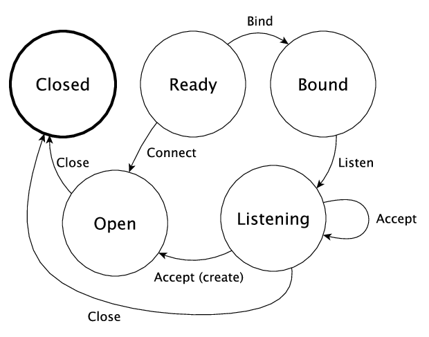

.. _netexample:

***********************************
Example: Network Socket Programming
***********************************

The POSIX sockets API supports communication between processes across a
network. A *socket* represents an endpoint of a network communication, and can be
in one of several states: 

* ``Ready``, the initial state
* ``Bound``, meaning that it has been bound to an address ready for incoming
  connections
* ``Listening``, meaning that it is listening for incoming connections
* ``Open``, meaning that it is ready for sending and receiving data;
* ``Closed``, meaning that it is no longer active.

The following diagram shows how the operations provided by the API modify the
state, where ``Ready`` is the initial state:

|netstate|

If a connection is ``Open``, then we can also ``send`` messages to the
other end of the connection, and ``recv`` messages from it.

The ``contrib`` package provides a module ``Network.Socket`` which
provides primitives for creating sockets and sending and receiving
messages. It includes the following functions:

.. code-block:: idris

    bind : (sock : Socket) -> (addr : Maybe SocketAddress) -> (port : Port) -> IO Int
    connect : (sock : Socket) -> (addr : SocketAddress) -> (port : Port) -> IO ResultCode
    listen : (sock : Socket) -> IO Int
    accept : (sock : Socket) -> IO (Either SocketError (Socket, SocketAddress))
    send : (sock : Socket) -> (msg  : String) -> IO (Either SocketError ResultCode)
    recv : (sock : Socket) -> (len : ByteLength) -> IO (Either SocketError (String, ResultCode))
    close : Socket -> IO ()

These functions cover the state transitions in the diagram above, but
none of them explain how the operations affect the state! It's perfectly
possible, for example, to try to send a message on a socket which is
not yet ready, or to try to receive a message after the socket is closed.

Using ``ST``, we can provide a better API which explains exactly how
each operation affects the state of a connection. In this section, we'll
define a sockets API, then use it to implement an "echo" server which
responds to requests from a client by echoing back a single message sent
by the client.

Defining a ``Sockets`` interface
================================

Rather than using ``IO`` for low level socket programming, we'll implement
an interface using ``ST`` which describes precisely how each operation
affects the states of sockets, and describes when sockets are created
and removed. We'll begin by creating a type to describe the abstract state
of a socket:

.. code-block:: idris

  data SocketState = Ready | Bound | Listening | Open | Closed

Then, we'll begin defining an interface, starting with a ``Sock`` type 
for representing sockets, parameterised by their current state:

.. code-block:: idris

  interface Sockets (m : Type -> Type) where
    Sock : SocketState -> Type

We create sockets using the ``socket`` method. The ``SocketType`` is defined
by the sockets library, and describes whether the socket is TCP, UDP,
or some other form. We'll use ``Stream`` for this throughout, which indicates a
TCP socket.
    
.. code-block:: idris

    socket : SocketType -> ST m (Either () Var) [addIfRight (Sock Ready)]

Remember that ``addIfRight`` adds a resource if the result of the operation
is of the form ``Right val``. By convention in this interface, we'll use
``Either`` for operations which might fail, whether or not they might carry
any additional information about the error, so that we can consistently
use ``addIfRight`` and some other type level functions.

To define a server, once we've created a socket, we need to ``bind`` it
to a port. We can do this with the ``bind`` method:

.. code-block:: idris

    bind : (sock : Var) -> (addr : Maybe SocketAddress) -> (port : Port) ->
           ST m (Either () ()) [sock ::: Sock Ready :-> (Sock Closed `or` Sock Bound)]

Binding a socket might fail, for example if there is already a socket
bound to the given port, so again it returns a value of type ``Either``.
The action here uses a type level function ``or``, and says that:

* If ``bind`` fails, the socket moves to the ``Sock Closed`` state
* If ``bind`` succeeds, the socket moves to the ``Sock Bound`` state, as
  shown in the diagram above

``or`` is implemented as follows:

.. code-block:: idris

    or : a -> a -> Either b c -> a
    or x y = either (const x) (const y)

So, the type of ``bind`` could equivalently be written as:

.. code-block:: idris

    bind : (sock : Var) -> (addr : Maybe SocketAddress) -> (port : Port) ->
           STrans m (Either () ()) [sock ::: Sock Ready]
                        (either [sock ::: Sock Closed] [sock ::: Sock Bound])

However, using ``or`` is much more concise than this, and attempts to
reflect the state transition diagram as directly as possible while still
capturing the possibility of failure.

Once we've bound a socket to a port, we can start listening for connections
from clients:

.. code-block:: idris

    listen : (sock : Var) ->
             ST m (Either () ()) [sock ::: Sock Bound :-> (Sock Closed `or` Sock Listening)]

A socket in the ``Listening`` state is ready to accept connections from
individual clients:

.. code-block:: idris

    accept : (sock : Var) ->
             ST m (Either () Var)
                  [sock ::: Sock Listening, addIfRight (Sock Open)]

If there is an incoming connection from a client, ``accept`` adds a *new*
resource to the end of the resource list (by convention, it's a good idea
to add resources to the end of the list, because this works more tidily
with ``updateWith``, as discussed in the previous section). So, we now
have *two* sockets: one continuing to listen for incoming connections,
and one ready for communication with the client.

We also need methods for sending and receiving data on a socket:

.. code-block:: idris

    send : (sock : Var) -> String ->
           ST m (Either () ()) [sock ::: Sock Open :-> (Sock Closed `or` Sock Open)]
    recv : (sock : Var) ->
           ST m (Either () String) [sock ::: Sock Open :-> (Sock Closed `or` Sock Open)]

Once we've finished communicating with another machine via a socket, we'll
want to ``close`` the connection and remove the socket:

.. code-block:: idris

    close : (sock : Var) ->
            {auto prf : CloseOK st} -> ST m () [sock ::: Sock st :-> Sock Closed]
    remove : (sock : Var) ->
             ST m () [Remove sock (Sock Closed)]

We have a predicate ``CloseOK``, used by ``close`` in an implicit proof
argument, which describes when it is okay to close a socket: 

.. code-block:: idris

  data CloseOK : SocketState -> Type where
       CloseOpen : CloseOK Open
       CloseListening : CloseOK Listening

That is, we can close a socket which is ``Open``, talking to another machine,
which causes the communication to terminate.  We can also close a socket which
is ``Listening`` for incoming connections, which causes the server to stop
accepting requests.

In this section, we're implementing a server, but for completeness we may
also want a client to connect to a server on another machine. We can do
this with ``connect``:

.. code-block:: idris

    connect : (sock : Var) -> SocketAddress -> Port ->
              ST m (Either () ()) [sock ::: Sock Ready :-> (Sock Closed `or` Sock Open)]

For reference, here is the complete interface:

.. code-block:: idris

  interface Sockets (m : Type -> Type) where
    Sock : SocketState -> Type
    socket : SocketType -> ST m (Either () Var) [addIfRight (Sock Ready)]
    bind : (sock : Var) -> (addr : Maybe SocketAddress) -> (port : Port) ->
           ST m (Either () ()) [sock ::: Sock Ready :-> (Sock Closed `or` Sock Bound)]
    listen : (sock : Var) ->
             ST m (Either () ()) [sock ::: Sock Bound :-> (Sock Closed `or` Sock Listening)]
    accept : (sock : Var) ->
             ST m (Either () Var) [sock ::: Sock Listening, addIfRight (Sock Open)]
    connect : (sock : Var) -> SocketAddress -> Port ->
              ST m (Either () ()) [sock ::: Sock Ready :-> (Sock Closed `or` Sock Open)]
    close : (sock : Var) -> {auto prf : CloseOK st} ->
            ST m () [sock ::: Sock st :-> Sock Closed]
    remove : (sock : Var) -> ST m () [Remove sock (Sock Closed)]
    send : (sock : Var) -> String ->
           ST m (Either () ()) [sock ::: Sock Open :-> (Sock Closed `or` Sock Open)]
    recv : (sock : Var) -> 
           ST m (Either () String) [sock ::: Sock Open :-> (Sock Closed `or` Sock Open)]

We'll see how to implement this shortly; mostly, the methods can be implemented
in ``IO`` by using the raw sockets API directly. First, though, we'll see
how to use the API to implement an "echo" server.

Implementing an "Echo" server with ``Sockets``
==============================================

At the top level, our echo server begins and ends with no resources available,
and uses the ``ConsoleIO`` and ``Sockets`` interfaces:

.. code-block:: idris

  startServer : (ConsoleIO m, Sockets m) => ST m () []

The first thing we need to do is create a socket for binding to a port
and listening for incoming connections, using ``socket``. This might fail,
so we'll need to deal with the case where it returns ``Right sock``, where
``sock`` is the new socket variable, or wher it returns ``Left err``:

.. code-block:: idris

  startServer : (ConsoleIO m, Sockets m) => ST m () []
  startServer =
    do Right sock <- socket Stream
             | Left err => pure ()
       ?whatNow

It's a good idea to implement this kind of function interactively, step by
step, using holes to see what state the overall system is in after each
step. Here, we can see that after a successful call to ``socket``, we
have a socket available in the ``Ready`` state:

.. code-block:: idris

      sock : Var
      m : Type -> Type
      constraint : ConsoleIO m
      constraint1 : Sockets m
    --------------------------------------
    whatNow : STrans m () [sock ::: Sock Ready] (\result1 => [])

Next, we need to bind the socket to a port, and start listening for
connections. Again, each of these could fail. If they do, we'll remove
the socket. Failure always results in a socket in the ``Closed`` state,
so all we can do is ``remove`` it:

.. code-block:: idris

  startServer : (ConsoleIO m, Sockets m) => ST m () []
  startServer =
    do Right sock <- socket Stream        | Left err => pure ()
       Right ok <- bind sock Nothing 9442 | Left err => remove sock
       Right ok <- listen sock            | Left err => remove sock
       ?runServer

Finally, we have a socket which is listening for incoming connections:

.. code-block:: idris

      ok : ()
      sock : Var
      ok1 : ()
      m : Type -> Type
      constraint : ConsoleIO m
      constraint1 : Sockets m
    --------------------------------------
    runServer : STrans m () [sock ::: Sock Listening]
                       (\result1 => [])

We'll implement this in a separate function. The type of ``runServer``
tells us what the type of ``echoServer`` must be (noting that we need
to give the ``m`` argument to ``Sock`` explicitly):

.. code-block:: idris

  echoServer : (ConsoleIO m, Sockets m) => (sock : Var) ->
               ST m () [remove sock (Sock {m} Listening)]

We can complete the definition of ``startServer`` as follows:

.. code-block:: idris

  startServer : (ConsoleIO m, Sockets m) => ST m () []
  startServer =
    do Right sock <- socket Stream        | Left err => pure ()
       Right ok <- bind sock Nothing 9442 | Left err => remove sock
       Right ok <- listen sock            | Left err => remove sock
       echoServer sock

In ``echoServer``, we'll keep accepting requests and responding to them
until something fails, at which point we'll close the sockets and
return. We begin by trying to accept an incoming connection:

.. code-block:: idris

  echoServer : (ConsoleIO m, Sockets m) => (sock : Var) ->
               ST m () [remove sock (Sock {m} Listening)]
  echoServer sock =
    do Right new <- accept sock | Left err => do close sock; remove sock
       ?whatNow

If ``accept`` fails, we need to close the ``Listening`` socket and
remove it before returning, because the type of ``echoServer`` requires
this.

As always, implementing ``echoServer`` incrementally means that we can check
the state we're in as we develop. If ``accept`` succeeds, we have the
existing ``sock`` which is still listening for connections, and a ``new``
socket, which is open for communication:

.. code-block:: idris

      new : Var
      sock : Var
      m : Type -> Type
      constraint : ConsoleIO m
      constraint1 : Sockets m
    --------------------------------------
    whatNow : STrans m () [sock ::: Sock Listening, new ::: Sock Open]
                          (\result1 => [])

To complete ``echoServer``, we'll receive a message on the ``new``
socket, and echo it back. When we're done, we close the ``new`` socket,
and go back to the beginning of ``echoServer`` to handle the next
connection:

.. code-block:: idris

  echoServer : (ConsoleIO m, Sockets m) => (sock : Var) ->
               ST m () [remove sock (Sock {m} Listening)]
  echoServer sock =
    do Right new <- accept sock | Left err => do close sock; remove sock
       Right msg <- recv new | Left err => do close sock; remove sock; remove ne
       Right ok <- send new ("You said " ++ msg)
             | Left err => do remove new; close sock; remove sock
       close new; remove new; echoServer sock

Implementing ``Sockets``
========================

To implement ``Sockets`` in ``IO``, we'll begin by giving a concrete type
for ``Sock``. We can use the raw sockets API (implemented in
``Network.Sockeet``) for this, and use a ``Socket`` stored in a ``State``, no
matter what abstract state the socket is in:

.. code-block:: idris

  implementation Sockets IO where
    Sock _ = State Socket

Most of the methods can be implemented by using the raw socket API
directly, returning ``Left`` or ``Right`` as appropriate. For example,
we can implement ``socket``, ``bind`` and ``listen`` as follows:

.. code-block:: idris

    socket ty = do Right sock <- lift $ Socket.socket AF_INET ty 0
                        | Left err => pure (Left ())
                   lbl <- new sock
                   pure (Right lbl)
    bind sock addr port = do ok <- lift $ bind !(read sock) addr port
                             if ok /= 0
                                then pure (Left ())
                                else pure (Right ())
    listen sock = do ok <- lift $ listen !(read sock)
                     if ok /= 0
                        then pure (Left ())
                        else pure (Right ())

There is a small difficulty with ``accept``, however, because when we
use ``new`` to create a new resource for the open connection, it appears
at the *start* of the resource list, not the end. We can see this by
writing an incomplete definition, using ``returning`` to see what the
resources need to be if we return ``Right lbl``:

.. code-block:: idris

    accept sock = do Right (conn, addr) <- lift $ accept !(read sock)
                           | Left err => pure (Left ())
                     lbl <- new conn
                     returning (Right lbl) ?fixResources

It's convenient for ``new`` to add the resource to the beginning of the
list because, in general, this makes automatic proof construction with
an ``auto``-implicit easier for Idris. On the other hand, when we use
``call`` to make a smaller set of resources, ``updateWith`` puts newly
created resources at the *end* of the list, because in general that reduces
the amount of re-ordering of resources. 

If we look at the type of
``fixResources``, we can see what we need to do to finish ``accept``:

.. code-block:: idris

      _bindApp0 : Socket
      conn : Socket
      addr : SocketAddress
      sock : Var
      lbl : Var
    --------------------------------------
    fixResources : STrans IO () [lbl ::: State Socket, sock ::: State Socket]
                          (\value => [sock ::: State Socket, lbl ::: State Socket])

The current list of resources is ordered ``lbl``, ``sock``, and we need them
to be in the order ``sock``, ``lbl``. To help with this situation,
``Control.ST`` provides a primitive ``toEnd`` which moves a resource to the
end of the list. We can therefore complete ``accept`` as follows:

.. code-block:: idris

    accept sock = do Right (conn, addr) <- lift $ accept !(read sock)
                           | Left err => pure (Left ())
                     lbl <- new conn
                     returning (Right lbl) (toEnd lbl)

For the complete implementation of ``Sockets``, take a look at
``samples/ST/Net/Network.idr`` in the Idris distribution. You can also
find the complete echo server there, ``EchoServer.idr``. There is also
a higher level network protocol, ``RandServer.idr``, using a hierarchy of
state machines to implement a high level network communication protocol
in terms of the lower level sockets API. This also uses threading, to
handle incoming requests asyncronously. You can find some more detail
on threading and the random number server in the draft paper
`State Machines All The Way Down <https://www.idris-lang.org/drafts/sms.pdf>`_
by Edwin Brady.

