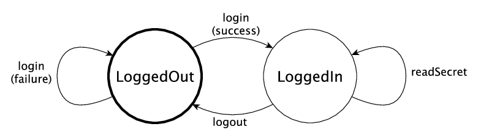

.. _smstypes:

***********************
State Machines in Types
***********************

In the introduction, we saw the following state transition diagram representing
the (abstract) states of a data store, and the actions we can perform on the
store:

|login|

We say that these are the *abstract* states of the store, because the concrete
state will contain a lot more information: for example, it might contain
user names, hashed passwords, the store contents, and so on. However, as far
as we are concerned for the actions ``login``, ``logout`` and ``readSecret``, 
it's whether we are logged in or not which affects which are valid.

We've seen how to manipulate states using ``ST``, and some small examples
of dependent types in states. In this section, we'll see how to use
``ST`` to provide a safe API for the data store. In the API, we'll encode
the above diagram in the types, in such a way that we can only execute the
operations ``login``, ``logout`` and ``readSecret`` when the state is
valid.

So far, we've used ``State`` and the primitive operations, ``new``, ``read``,
``write`` and ``delete`` to manipulate states. For the data store API,
however, we'll begin by defining an *interface* (see :ref:`sect-interfaces` in
the Idris tutorial) which describes the operations on the store, and explains
in their types exactly when each operation is valid, and how it affects
the store's state. By using an interface, we can be sure that 
this is the *only* way to access the store.

Defining an interface for the data store
========================================

We'll begin by defining a data type, in a file ``Login.idr``, which represents
the two abstract states of the store, either ``LoggedOut`` or ``LoggedIn``:

.. code-block:: idris

    data Access = LoggedOut | LoggedIn

We can define a data type for representing the current state of a store,
holding all of the necessary information (this might be user names, hashed
passwords, store contents and so on) and parameterise it by the logged in
status of the store:

.. code-block:: idris

  Store : Access -> Type

Rather than defining a concrete type now, however, we'll include this in
a data store *interface* and define a concrete type later:

.. code-block:: idris

  interface DataStore (m : Type -> Type) where
    Store : Access -> Type

We can continue to populate this interface with operations on the store.  Among
other advantages, by separating the *interface* from its *implementation* we
can provide different concrete implementations for different contexts.
Furthermore, we can write programs which work with a store without needing
to know any details of how the store is implemented.

We'll need to be able to ``connect`` to a store, and ``disconnect`` when
we're done. Add the following methods to the ``DataStore`` interface:

.. code-block:: idris

    connect : ST m Var [add (Store LoggedOut)]
    disconnect : (store : Var) -> ST m () [remove store (Store LoggedOut)]

The type of ``connect`` says that it returns a new resource which has the
initial type ``Store LoggedOut``. Conversely, ``disconnect``, given a
resource in the state ``Store LoggedOut``, removes that resource.
We can see more clearly what ``connect`` does by trying the following
(incomplete) definition:

.. code-block:: idris

  doConnect : DataStore m => ST m () []
  doConnect = do st <- connect
                 ?whatNow

Note that we're working in a *generic* context ``m``, constrained so that
there must be an implementation of ``DataStore`` for ``m`` to be able to
execute ``doConnect``.
If we check the type of ``?whatNow``, we'll see that the remaining
operations begin with a resource ``st`` in the state ``Store LoggedOut``,
and we need to finish with no resources.

.. code-block:: idris

      m : Type -> Type
      constraint : DataStore m
      st : Var
    --------------------------------------
    whatNow : STrans m () [st ::: Store LoggedOut] (\result => [])

Then, we can remove the resource using ``disconnect``:

.. code-block:: idris

  doConnect : DataStore m => ST m () []
  doConnect = do st <- connect
                 disconnect st
                 ?whatNow

Now checking the type of ``?whatNow`` shows that we have no resources
available:

.. code-block:: idris

      m : Type -> Type
      constraint : DataStore m
      st : Var
    --------------------------------------
    whatNow : STrans m () [] (\result => [])

To continue our implementation of the ``DataStore`` interface, next we'll add a
method for reading the secret data. This requires that the ``store`` is in the
state ``Store LoggedIn``:

.. code-block:: idris

    readSecret : (store : Var) -> ST m String [store ::: Store LoggedIn]

At this point we can try writing a function which connects to a store,
reads the secret, then disconnects. However, it will be unsuccessful, because
``readSecret`` requires us to be logged in:

.. code-block:: idris

  badGet : DataStore m => ST m () []
  badGet = do st <- connect
              secret <- readSecret st
              disconnect st

This results in the following error, because ``connect`` creates a new
store in the ``LoggedOut`` state, and ``readSecret`` requires the store
to be in the ``LoggedIn`` state:

.. code-block:: idris

    When checking an application of function Control.ST.>>=:
        Error in state transition:
                Operation has preconditions: [st ::: Store LoggedOut]
                States here are: [st ::: Store LoggedIn]
                Operation has postconditions: \result => []
                Required result states here are: \result => []

The error message explains how the required input states (the preconditions)
and the required output states (the postconditions) differ from the states
in the operation. In order to use ``readSecret``, we'll need a way to get
from a ``Store LoggedOut`` to a ``Store LoggedIn``. As a first attempt,
we can try the following type for ``login``:

.. code-block:: idris

    login : (store : Var) -> ST m () [store ::: Store LoggedOut :-> Store LoggedIn] -- Incorrect type!

Note that in the *interface* we say nothing about *how* ``login`` works;
merely how it affects the overall state. Even so, there is a problem with
the type of ``login``, because it makes the assumption that it will always
succeed. If it fails - for example because the implementation prompts for
a password and the user enters the password incorrectly - then it must not
result in a ``LoggedIn`` store.

Instead, therefore, ``login`` will return whether logging in was successful,
via the following type;

.. code-block:: idris

    data LoginResult = OK | BadPassword

Then, we can *calculate* the result state (see :ref:`depstate`) from the
result. Add the following method to the ``DataStore`` interface:

.. code-block:: idris

    login : (store : Var) ->
            ST m LoginResult [store ::: Store LoggedOut :->
                               (\res => Store (case res of
                                                    OK => LoggedIn
                                                    BadPassword => LoggedOut))]

If ``login`` was successful, then the state after ``login`` is
``Store LoggedIn``. Otherwise, the state is ``Store LoggedOut``.

To complete the interface, we'll add a method for logging out of the store.
We'll assume that logging out is always successful, and moves the store
from the ``Store LoggedIn`` state to the ``Store LoggedOut`` state.

.. code-block:: idris

    logout : (store : Var) -> ST m () [store ::: Store LoggedIn :-> Store LoggedOut]

This completes the interface, repeated in full for reference below:

.. code-block:: idris

  interface DataStore (m : Type -> Type) where
    Store : Access -> Type

    connect : ST m Var [add (Store LoggedOut)]
    disconnect : (store : Var) -> ST m () [remove store (Store LoggedOut)]

    readSecret : (store : Var) -> ST m String [store ::: Store LoggedIn]
    login : (store : Var) ->
            ST m LoginResult [store ::: Store LoggedOut :->
                               (\res => Store (case res of
                                                    OK => LoggedIn
                                                    BadPassword => LoggedOut))]
    logout : (store : Var) -> ST m () [store ::: Store LoggedIn :-> Store LoggedOut]

Before we try creating any implementations of this interface, let's see how
we can write a function with it, to log into a data store, read the secret
if login is successful, then log out again.

Writing a function with the data store
======================================

As an example of working with the ``DataStore`` interface, we'll write a
function ``getData``, which connects to a store in order to read some data from
it. We'll write this function interactively, step by step, using the types of
the operations to guide its development. It has the following type:

.. code-block:: idris

  getData : (ConsoleIO m, DataStore m) => ST m () []

This type means that there are no resources available on entry or exit.
That is, the overall list of actions is ``[]``, meaning that at least
externally, the function has no overall effect on the resources. In other
words, for every resource we create during ``getData``, we'll also need to
delete it before exit.

Since we want to use methods of the ``DataStore`` interface, we'll
constraint the computation context ``m`` so that there must be an
implementation of ``DataStore``. We also have a constraint ``ConsoleIO m``
so that we can display any data we read from the store, or any error
messages.

We start by connecting to the store, creating a new resource ``st``, then
trying to ``login``:

.. code-block:: idris

  getData : (ConsoleIO m, DataStore m) => ST m () []
  getData = do st <- connect
               ok <- login st
               ?whatNow

Logging in will either succeed or fail, as reflected by the value of
``ok``. If we check the type of ``?whatNow``, we'll see what state the
store currently has:

.. code-block:: idris

      m : Type -> Type
      constraint : ConsoleIO m
      constraint1 : DataStore m
      st : Var
      ok : LoginResult
    --------------------------------------
    whatNow : STrans m () [st ::: Store (case ok of   
                                              OK => LoggedIn 
                                              BadPassword => LoggedOut)]
                          (\result => [])

The current state of ``st`` therefore depends on the value of ``ok``,
meaning that we can make progress by case splitting on ``ok``:

.. code-block:: idris

  getData : (ConsoleIO m, DataStore m) => ST m () []
  getData = do st <- connect
               ok <- login st
               case ok of
                    OK => ?whatNow_1
                    BadPassword => ?whatNow_2

The types of the holes in each branch, ``?whatNow_1`` and ``?whatNow_2``,
show how the state changes depending on whether logging in was successful.
If it succeeded, the store is ``LoggedIn``:

.. code-block:: idris

    --------------------------------------
    whatNow_1 : STrans m () [st ::: Store LoggedIn] (\result => [])

On the other hand, if it failed, the store is ``LoggedOut``:

.. code-block:: idris

    --------------------------------------
    whatNow_2 : STrans m () [st ::: Store LoggedOut] (\result => [])

In ``?whatNow_1``, since we've successfully logged in, we can now read
the secret and display it to the console:

.. code-block:: idris

  getData : (ConsoleIO m, DataStore m) => ST m () []
  getData = do st <- connect
               ok <- login st
               case ok of
                    OK => do secret <- readSecret st
                             putStrLn ("Secret is: " ++ show secret)
                             ?whatNow_1
                    BadPassword => ?whatNow_2

We need to finish the ``OK`` branch with no resources available. We can
do this by logging out of the store then disconnecting:

.. code-block:: idris

  getData : (ConsoleIO m, DataStore m) => ST m () []
  getData = do st <- connect
               ok <- login st
               case ok of
                    OK => do secret <- readSecret st
                             putStrLn ("Secret is: " ++ show secret)
                             logout st
                             disconnect st
                    BadPassword => ?whatNow_2

Note that we *must* ``logout`` of ``st`` before calling ``disconnect``,
because ``disconnect`` requires that the store is in the ``LoggedOut``
state.

Furthermore, we can't simply use ``delete`` to remove the resource, as
we did with the ``State`` examples in the previous section, because
``delete`` only works when the resource has type ``State ty``, for some
type ``ty``. If we try to use ``delete`` instead of ``disconnect``, we'll
see an error message like the following:

.. code-block:: idris

    When checking argument prf to function Control.ST.delete:
            Can't find a value of type
                    InState st (State st) [st ::: Store LoggedOut]

In other words, the type checker can't find a proof that the resource
``st`` has a type of the form ``State st``, because its type is
``Store LoggedOut``. Since ``Store`` is part of the ``DataStore`` interface,
we *can't* yet know the concrete representation of the ``Store``, so we
need to remove the resource via the interface, with ``disconnect``, rather
than directly with ``delete``.

We can complete ``getData`` as follows, using a pattern matching bind
alternative (see the Idris tutorial, :ref:`monadsdo`) rather than a
``case`` statement to catch the possibilty of an error with ``login``:

.. code-block:: idris

  getData : (ConsoleIO m, DataStore m) => ST m () []
  getData = do st <- connect
               OK <- login st
                  | BadPassword => do putStrLn "Failure"
                                      disconnect st
               secret <- readSecret st
               putStrLn ("Secret is: " ++ show secret)
               logout st
               disconnect st

We can't yet try this out, however, because we don't have any implementations
of ``getData``! If we try to execute it in an ``IO`` context, for example,
we'll get an error saying that there's no implementation of ``DataStore IO``:

.. code::

    *Login> :exec run {m = IO} getData
    When checking an application of function Control.ST.run:
            Can't find implementation for DataStore IO

The final step in implementing a data store which correctly follows the
state transition diagram, therefore, is to provide an implementation
of ``DataStore``.

Implementing the interface
==========================

To execute ``getData`` in ``IO``, we'll need to provided an implementation
of ``DataStore`` which works in the ``IO`` context. We can begin as
follows:

.. code-block:: idris

  implementation DataStore IO where

Then, we can ask Idris to populate the interface with skeleton definitions
for the necessary methods (press ``Ctrl-Alt-A`` in Atom for "add definition"
or the corresponding shortcut for this in the Idris mode in your favourite
editor):

.. code-block:: idris

  implementation DataStore IO where
    Store x = ?DataStore_rhs_1
    connect = ?DataStore_rhs_2
    disconnect store = ?DataStore_rhs_3
    readSecret store = ?DataStore_rhs_4
    login store = ?DataStore_rhs_5
    logout store = ?DataStore_rhs_6

The first decision we'll need to make is how to represent the data store.
We'll keep this simple, and store the data as a single ``String``, using
a hard coded password to gain access. So, we can define ``Store`` as
follows, using a ``String`` to represent the data no matter whether we
are ``LoggedOut`` or ``LoggedIn``:

.. code-block:: idris

    Store x = State String

Now that we've given a concrete type for ``Store``, we can implement operations
for connecting, disconnecting, and accessing the data. And, since we used
``State``, we can use ``new``, ``delete``, ``read`` and ``write`` to
manipulate the store.

Looking at the types of the holes tells us how we need to manipulate the
state. For example, the ``?DataStore_rhs_2`` hole tells us what we need
to do to implement ``connect``. We need to return a new ``Var`` which 
represents a resource of type ``State String``:

.. code-block:: idris

    --------------------------------------
    DataStore_rhs_2 : STrans IO Var [] (\result => [result ::: State String])

We can implement this by creating a new variable with some data for the
content of the store (we can use any ``String`` for this) and returning
that variable:

.. code-block:: idris

    connect = do store <- new "Secret Data"
                 pure store

For ``disconnect``, we only need to delete the resource:

.. code-block:: idris

    disconnect store = delete store

For ``readSecret``, we need to read the secret data and return the
``String``. Since we now know the concrete representation of the data is
a ``State String``, we can use ``read`` to access the data directly:

.. code-block:: idris

    readSecret store = read store

We'll do ``logout`` next and return to ``login``. Checking the hole
reveals the following:

.. code-block:: idris

      store : Var
    --------------------------------------
    DataStore_rhs_6 : STrans IO () [store ::: State String] (\result => [store ::: State String])

So, in this minimal implementation, we don't actually have to do anything!

.. code-block:: idris

    logout store = pure ()

For ``login``, we need to return whether logging in was successful. We'll
do this by prompting for a password, and returning ``OK`` if it matches
a hard coded password, or ``BadPassword`` otherwise:

.. code-block:: idris

    login store = do putStr "Enter password: "
                     p <- getStr
                     if p == "Mornington Crescent"
                        then pure OK
                        else pure BadPassword

For reference, here is the complete implementation which allows us to
execute a ``DataStore`` program at the REPL:

.. code-block:: idris

  implementation DataStore IO where
    Store x = State String
    connect = do store <- new "Secret Data"
                 pure store
    disconnect store = delete store
    readSecret store = read store
    login store = do putStr "Enter password: "
                     p <- getStr
                     if p == "Mornington Crescent"
                        then pure OK
                        else pure BadPassword
    logout store = pure ()

Finally, we can try this at the REPL as follows (Idris defaults to the
``IO`` context at the REPL if there is an implementation available, so no
need to give the ``m`` argument explicitly here):

.. code:: 

    *Login> :exec run getData
    Enter password: Mornington Crescent
    Secret is: "Secret Data"

    *Login> :exec run getData
    Enter password: Dollis Hill
    Failure

We can only use ``read``, ``write``, ``new`` and ``delete`` on a resource
with a ``State`` type. So, *within* the implementation of ``DataStore``,
or anywhere where we know the context is ``IO``, we can access the data store
however we like: this is where the internal details of ``DataStore`` are
implemented. However, if we merely have a constraint ``DataStore m``, we can't
know how the store is implemented, so we can only access via the API given
by the ``DataStore`` interface.

It is therefore good practice to use a *generic* context ``m`` for functions
like ``getData``, and constrain by only the interfaces we need, rather than
using a concrete context ``IO``.

We've now seen how to manipulate states, and how to encapsulate state
transitions for a specific system like the data store inn an interface.
However, realistic systems will need to *compose* state machines. We'll
either need to use more than one state machine at a time, or implement one
state machine in terms of one or more others. We'll see how to achieve this
in the next section.

